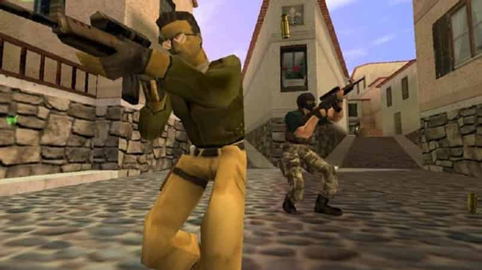
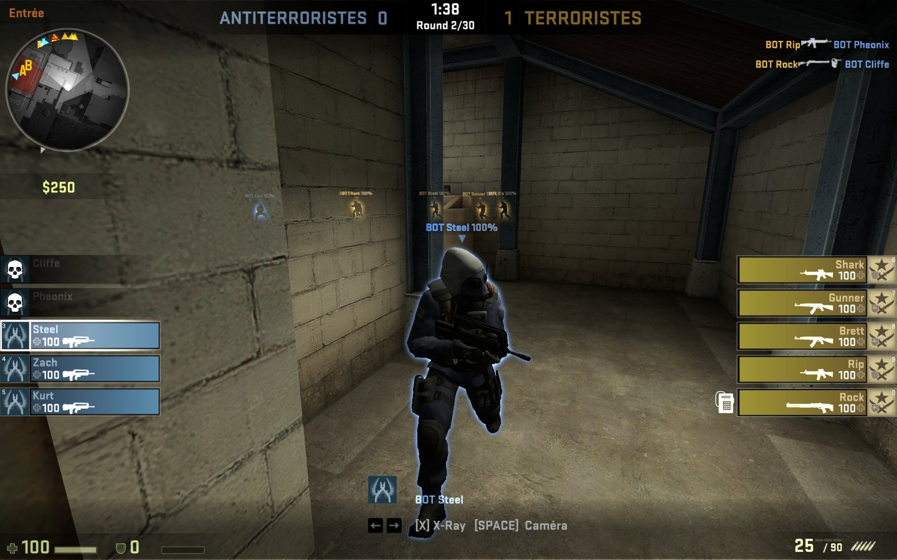
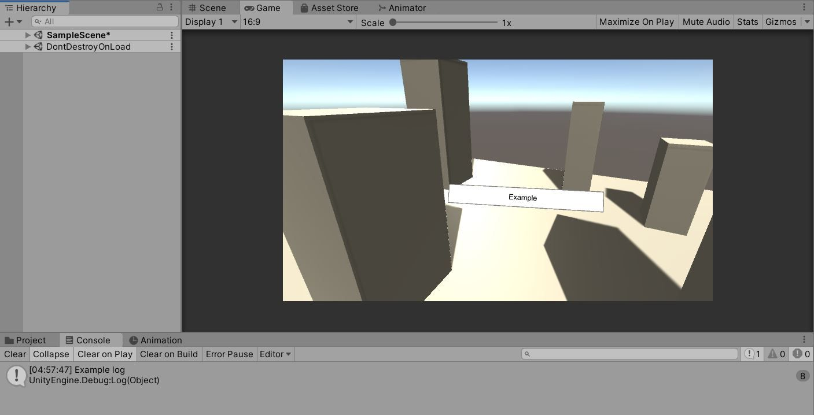
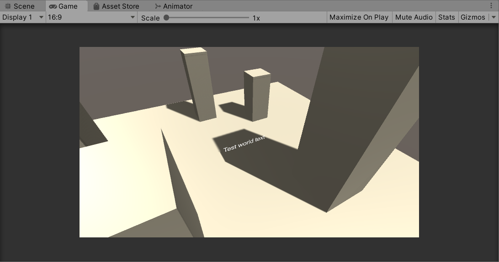
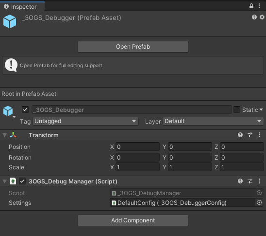
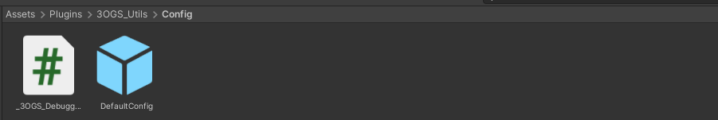
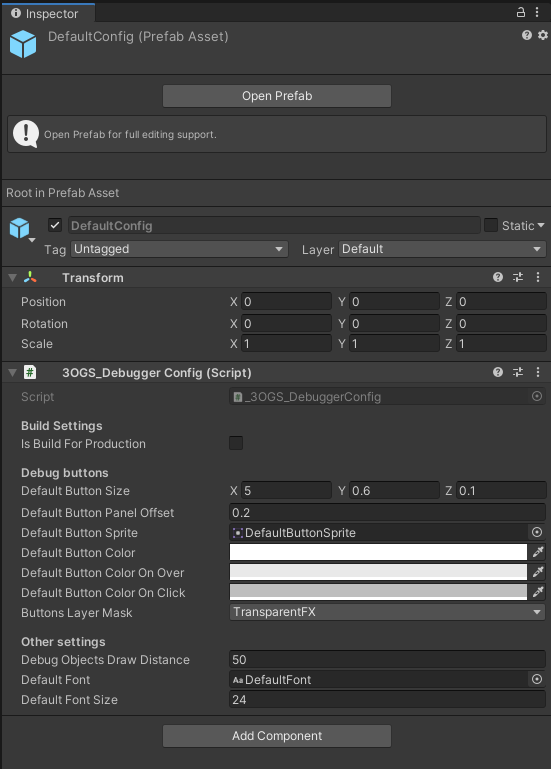

# Features
### 3OGS_Utils: CreateKeyCodeAction
Esta función es muy tan útil como simple, su primer parámetro es una KeyCode y el segundo un Action que se llamará al presionar dicha tecla.

Retorna una instancia de FunctionUpdater, un monobehaviour que viene con el plugin y se explicará más adelante, por el momento podemos ignorarlo.

```
public static FunctionUpdater 3OGS_Utils.CreateKeyCodeAction(KeyCode key, Action onKeyDown)
```
Ejemplo de uso:

```
void Start() {
	3OGS_Utils.CreateKeyCodeAction(KeyCode.A, () => Debug.Log("Hello (:-D)"));
}
```



### 3OGS_Utils: Cameras & CameraSwitcher
Con el objetivo de navegar rápidamente por la escena, este plugin te permite instanciar dos tipos de cámara de espectador en tiempo de ejecución y con apenas unas líneas de código. Esto es principalmente útil en Dev Builds para recorrer la escena libremente y asegurarse de que todo funciona como debe, ya que en una Dev Build no podrás usar la vista de escena del editor.

En esta versión existen dos tipos de cámaras;

#### **FreeLookCamera**
Una cámara de vista libre que se maneja con WASD, el ratón, Q y E, al mantener click derecho la cámara deja de moverse y el cursor del mouse aparece, el cursor del mouse está oculto por defecto en esta cámara. Es parecida a la cámara de vista libre en Counter Strike.

```
public static void _3OGS_Debug.UseFreeLookCamera()
```

Ejemplo de implementación:

```
void Start() {
    if(Input.GetMouseButtonDown(0))
        _3OGS_Debug.UseFreeLookCamera();
}
```

Un mejor ejemplo de implementación:

```
void Start() {
    _3OGS_Utils.CreateKeyCodeAction(KeyCode.F1,
        () => {
            if (_3OGS_Utils.IsBuildForProduction()) return; // Do nothing
            _3OGS_Debug.UseFreeLookCamera();
        });
}
```

----
💡 Momento de imaginación: Desarrollas un videojuego FPS multijugador online, necesitas probar en una Dev Build que al presionar el botón de un bunker, 4 puertas(a las que tardarías
mucho en llegar si caminaras) se cierren, en ese momento puedes activar la FreeLookCamera para comprobar el estado y comportamiento de las puertas y otros jugadores al tratar de
usarlas. Entonces no tendrás que caminar a ellas cada vez que pruebes. Seguro ya se te ocurrirán muchos escenarios dónde se puede ahorrar mucho tiempo usando una free look camera.
    
----
  
#### **RotateAroundCamera**
Una cámara que sigue un objetivo y puede rotar al rededor de él, siempre mirando al mismo. Para rotar la cámara se utiliza el botón central del ratón, para hacer zoom se utiliza la rueda. Es parecida a la cámara que sigue los personajes en Counter Strike.



```
public static void _3OGS_Debug.UseRotateAroundTargetCamera(Transform target)
```

Ejemplos de implementación:

```
GameObject anyObject = GameObject.Find("AnyObject");

_3OGS_Utils.CreateKeyCodeAction(KeyCode.F2,
    () => {
        if (_3OGS_Utils.IsBuildForProduction()) return;
        _3OGS_Debug.UseRotateAroundTargetCamera(anyObject.transform);
    });
```
----
💡 Momento de imaginación: Desarrollas un videojuego de aviones de combate multijugador online, necesitas probar en una Dev Build que los aviones y misiles se comporten correctamente, ahí es dónde entra esta cámara. Cuando un avión enemigo dispara un misil utilizas la RotateAroundCamera para seguir el objeto misil y evaluar que su comportamiento sea el planeado. Esta cámara es perfecta para el debug de objetos que se mueven muy rápido o que se teletransportan.
   
----
  
#### **CameraSwitcher**
El CameraSwitcher es una pequeña clase encargada de manejar el cambio de cámara en el plugin. Esta clase tiene apenas 3 métodos;

```
public static void SetupCurrentCamera(Camera camera)

public static void SetupReturnAction(Action returnToPreviousCameraAction)

public static void SetupReturnAction(Camera camera, Action returnToPreviousCameraAction)

public static void ReturnToOriginalCamera()
```
  
##### **CameraSwitcher.SetupCurrentCamera(Camera camera)**
Este método es para establecer la current camera, el plugin lo utiliza al crear la FreeLookCamera y RotateAroundCamera.

    
##### **CameraSwitcher.SetupReturnAction(Action returnToPreviousCameraAction)**
Esté método es para establecer un callback que se llamará luego de llamar al método ReturnToOriginalCamera()

El callback podría usarse para restablecer objetos al volver a la cámara original del jugador. Por ejemplo, quizás quieras desactivar la GUI del jugador antes de pasar a la FreeLookCamera, pero al volver a la cámara original querrías volver a activar la GUI, para esto podrías usar el callback.
  
  
##### **CameraSwitcher.SetupReturnAction(Camera camera, Action returnToPreviousCameraAction)**
Este método es el mismo pero puedes especificar otra cámara a la que volver en vez de la original.
  

##### **CameraSwitcher.ReturnToOriginalCamera()**
Este método regresa a la cámara original, se considera a cámara original a la cámara por defecto al inicio de la escena.


### _3OGS_Debug: DebugButton & DebugButtonPanel
#### DebugButton
Un DebugButton es un botón en el mundo(es decir que no es parte de la UI, no está dentro de un canvas). Los DebugButton tienen un Action onClickFunction que se llama al ser presionados. También se les puede asignar un objeto padre de modo que los botones siempre estén con el objeto en caso de ser un objeto en movimiento.

```
public static GameObject _3OGS_Debug.CreateDebugButton(
                                                    string btnLabel,
                                                    Vector3 position,
                                                    Action onClickFunction,
                                                    bool rotateToCamera = true
                                                    )

public static GameObject _3OGS_Debug.CreateDebugButton(
                                                    Transform parent,
                                                    string btnLabel,
                                                    Vector3 position,
                                                    Action onClickFunction,
                                                    bool rotateToCamera = true
                                                    )
```

Ejemplo de implementación:

```
GameObject btnObj = _3OGS_Debug.CreateDebugButton("Example",
                                                Vector3.up,
                                                () => Debug.Log("Example log"));
```


#### DebugButtonPanel
El DebugButtonPanel es simplemente un contenedor para asignar un conjunto de botones a un objeto particular de manera prolija. También puedes asignarle un parent.

##### **DebugButtonPanel.CreateButtonPanel**

Primero debes crear un DebugButtonPanel con cualquiera de esos métodos.

```
public static GameObject DebugButtonPanel.CreateButtonPanel(Vector3 position)

public static GameObject DebugButtonPanel.CreateButtonPanel(Transform parent, Vector3 position)
```

##### **DebugButtonPanel.AddButton**

Luego debes añadirle un botón con uno de estos métodos

```
public static void DebugButtonPanel.AddButton(DebugButtonPanel btnPanel, string btnLabel, Action onClickFunction)

public static void DebugButtonPanel.AddButton(DebugButtonPanel btnPanel, string btnLabel, string btnMessage)
```

Ejemplo de implementación:

```
GameObject btnPanel = _3OGS_Debug.CreateButtonPanel(Vector3.up);
DebugButtonPanel.AddButton(
                  btnPanel.GetComponent<DebugButtonPanel>(),
                  "Test 1",
                  () => _3OGS_Debug.TextPopup("Test1", Vector3.up));
                  
DebugButtonPanel.AddButton(
                  btnPanel.GetComponent<DebugButtonPanel>(),
                  "Test 2",
                  () => _3OGS_Debug.TextPopup("Test2", Vector3.up));
                  
DebugButtonPanel.AddButton(
                  btnPanel.GetComponent<DebugButtonPanel>(),
                  "Test 3",
                  "This is a add button test!");
```
----
💡 Momento de imaginación: Tienes un Orco que en su AI implementa una finite state machine, el orco tiene 4 estados; descansar, patrullar, moverse y atacar. Para entrar a cada uno de estos estados se deben cumplir distintas condiciones que pueden o no involucrar al jugador. Testear todos los estados puede ser tedioso si para hacerlo necesitamos hacer que el personaje cumpla las condiciones para entrar en el estado que necesitamos. Hay diversas soluciones a este problema, un DebugButtonPanel es una de ellas que sólo lleva tantas líneas de código como estados en la state machine tengas. Al a hacer click en un botón en el mundo podrás cambiar a antojo el estado de la state machine.
   
----
  
### _3OGS_Debug: WorldText & TextPopup
Como he dicho anteriormente, la consola en algunos proyectos puede estar llena de logs de distintos orígenes haciendo difícil trackear tus propios logs. Para evitar esto y poder loggear información sin necesidad si quiera de mover tu vista de la ventana “Game” existen WorldText & TextPopup. Además gracias a ellos puedes loggear información en una Dev Build.

#### **WorldText**
Es un TextMesh(no TextMeshPro) en el mundo, es estático.



```
public static GameObject _3OGS_Debug.WorldText(
                                            string text,
                                            Transform parent = null,
                                            Vector3 localPosition = default(Vector3),
                                            int fontSize = 40,
                                            Color? color = null,
                                            TextAnchor textAnchor = TextAnchor.UpperLeft,
                                            TextAlignment textAlignment = TextAlignment.Left,
                                            int sortingOrder = _3OGS_Utils.sortingOrderDefault
                                            )
```

Ejemplo de implementación:

```
_3OGS_Debug.WorldText(
                    text: "Door " + door.name,
                    localPosition: door.position + Vector.up * 0.5f,
                    fontSize: 20,
                    color: Color.red,
                    textAnchor: TextAnchor.MiddleCenter
                    );
```

#### **TextPopup**
Es un WorldText que al instanciarlo sube hacía arriba un poco hasta destruirse luego de un segundo.

```
public static void TextPopup(string text, Vector3 position)

public static void TextPopup(string text, Vector3 position, float popupTime)
```

Ejemplo de implementación:

```
GameObject btnObj = _3OGS_Debug.CreateDebugButton(
                                    "Example",
                                    Vector3.up,
                                    () => _3OGS_Debug.TextPopup("Example log", Vector3.up * 1.5f)
                                    );
```

### _3OGS_Utils: MonoBehaviour Functions
Las MonoBehaviour Functions son clases de utilería que heredan de MonoBehaviour, el plugin las utiliza y están disponibles para que cualquiera las use. Sin embargo cubriré su explicación de una mejor manera en la version 0.1.1 del plugin. Por ahora dejaré un pequeño resumen de cada una:

**FunctionUpdater:** Ejecuta una función como si la hubieras puesto dentro de un void Update()
```
FunctionUpdater.Create(() => { 
                            if(GameManager.PlayerDead)
                                Debug.Log("Player is dead");
                        });
```

**FunctionTimer:** Ejecuta una función luego de un temporizador
```
FunctionTimer.Create(() => { 
                        bomb.Explode();
                    }, 5f);
```

**FunctionPeriodic:** Ejecuta una función periódicamente cada X tiempo
```
FunctionPeriodic.Create(() => { 
                            enemyAI.TryAttack();
                        }, enemyAI.AttackVelocity);
```
  
Estas funciones son muy útiles para hacer prototipos rápido, pero no deberían usarse para juegos construir un juego completo ya que no son muy eficientes en el uso de recursos.

### RuntimeDebugObjectsManager
Puede llegar un punto en el que tengas tantos botones y textos en tu mundo que no puedas ver correctamente la escena, para resolver esto existen los métodos:

```
public static void _3OGS_Debug.RuntimeDebugObjectsManager.DisableDebugObjects()

public static void _3OGS_Debug.RuntimeDebugObjectsManager.EnableDebugObjects()
```

Estos sirven para ocultar o mostrar los DebugObjects en tu mundo, una buena implementación de ellos sería:

```
_3OGS_Utils.CreateKeyCodeAction(KeyCode.T,
        () => {
            if (_3OGS_Utils.IsBuildForProduction()) return;
            _3OGS_Debug.RuntimeDebugObjectsManager.DisableDebugObjects();
        });

_3OGS_Utils.CreateKeyCodeAction(KeyCode.R,
        () => {
            if (_3OGS_Utils.IsBuildForProduction()) return;
            _3OGS_Debug.RuntimeDebugObjectsManager.EnableDebugObjects();
        });
```

Ahora puedes ver lo útil que puede ser también CreateKeyCodeAction cuando lo combinas con otros métodos del plugin, vale la pena pensar en este tipo de combinaciones.

### _3OGS_DebugManager
Para usar el plugin debes tener un objeto con el script 3OGS_DebugManager en tu escena inicial. El manager hace una pequeña pero importante configuración de inicio. El plugin se configura con la referencia a un prefab en la variable Settings dentro del manager, este prefab debe contener el componente _3OGS_DebuggerConfig.



En la versión anterior se utilizaba un Scriptable Object para asignar la configuración, pero por razones de compatibilidad para viejas versiones de Unity ahora se configura el plugin de esta manera.
  
### Configuración del plugin
La configuración default del plugin está en la siguiente ruta:



Recomiendo crear una propia basándote en la existente.

La configuración default tiene los siguientes valores, sólo explicare los que considero necesarios porque sus nombres son suficiente para entender a qué pertenecen y para que sirven.



##### **IsBuildForProduction**

Este checkbox se describe solo y es muy importante, permite al programador hacer comprobaciones de versiones de producción del juego antes de ejecutar código correspondiente a las versiones de desarrollo los de proyectos que usen el plugin.
Un ejemplo:

```
void Start {
  if (_3OGS_Utils.IsBuildForProduction()) return;
  FunctionPeriodic.Create(() => { 
                        LogBossAIState();
                       }, 1f);
}
```
  
##### **DefaultButtonSize**

Dado que la escala de los objetos varía según proyecto, es importante saber que puedes configurar el tamaño de los botones. Al igual que el tamaño de fuente con DefaultFontSize.

##### **DefaultButtonPanelOffset**

Sencillamente el espacio entre los botones de un DebugButtonPanel.

##### **ButtonLayerMask**

Los botones tienen hacen uso de un BoxCollider para funcionar. Puedes configurar en que layer estarán los objetos para que no tengas colisiones no deseadas con ellos.

##### **DebugObjectsDrawDistance**

Los objetos de _3OGS_Debug desaparecen si la distancia es mayor a la establecida.

### Ejemplos
_3OGS_Utils viene con un script de ejemplo y un prefab con el script _3OGS_DebuggerManager para que puedas usar el plugin sólo agregando un objeto a la escena.